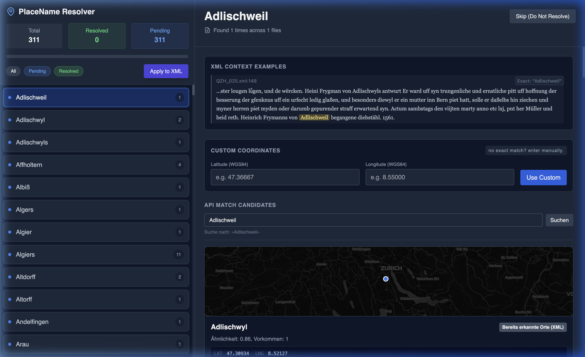

# QZH Ortsnamenreconciling

Diese App hilft dabei, Ortsnamen in TEI-XML-Dateien nachzupflegen.

Sie durchsucht alle XML-Dateien im Ordner `quellenstuecke_wip` nach `<placeName>`-Einträgen mit dem Platzhalter `LOC_Lat_Long`, zeigt diese in einer Weboberfläche an und unterstützt beim Ermitteln passender Koordinaten. Gefundene Treffer können übernommen und anschließend direkt in die XML-Dateien zurückgeschrieben werden.

## Was die App tut

- scannt die XML-Dateien in `quellenstuecke_wip`
- sammelt alle Ortsnamen mit dem Platzhalter `LOC_Lat_Long`
- zeigt pro Ort Fundstellen und Textkontext an
- sucht Koordinaten parallel über mehrere Quellen:
  - Wikidata
  - ortsnamen.ch
  - GeoAdmin
  - GeoNames
- erlaubt manuelle Koordinaten-Eingabe
- schreibt bestätigte Koordinaten als `LOC_<lat>_<lng>` zurück in die XML-Dateien


*Detailansicht eines Ortes mit Kontextbeispielen, manueller Eingabe und API-Vorschlägen.*

## Voraussetzungen

- Python 3.10 oder neuer
- `pip`
- Internetzugang, damit die externen Ortsdatenquellen abgefragt werden können

## Installation

Im Projektordner:

```bash
python3 -m venv .venv
source .venv/bin/activate
pip install -r requirements.txt
```

## App starten

```bash
python3 app.py
```

Danach die App im Browser öffnen:

```text
http://localhost:5000
```

## So benutzt man die App

1. App starten und `http://localhost:5000` öffnen.
2. In der linken Liste einen offenen Ortsnamen auswählen.
3. Treffer aus den vorgeschlagenen Quellen prüfen oder Koordinaten manuell eintragen.
4. Einen Treffer übernehmen oder den Eintrag überspringen.
5. Am Ende `Apply to XML` klicken, damit die Änderungen in die XML-Dateien geschrieben werden.

## Wichtige Hinweise

- Die App speichert den Bearbeitungsstand zunächst nur im laufenden Prozess.
- Erst mit `Apply to XML` werden die XML-Dateien tatsächlich geändert.
- Die Änderungen werden direkt in den Dateien unter `quellenstuecke_wip` vorgenommen.
- Ohne Netzwerk funktionieren Suche und Vorschläge aus den externen Quellen nicht.

## Projektstruktur

```text
app.py                 Flask-App und API-Endpunkte
xml_scan.py            XML-Scan und Ersetzen der Platzhalter
templates/index.html   Weboberfläche
quellenstuecke_wip/    XML-Dateien
requirements.txt       Python-Abhängigkeiten
```
